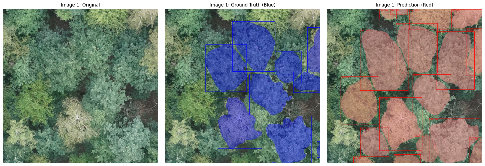
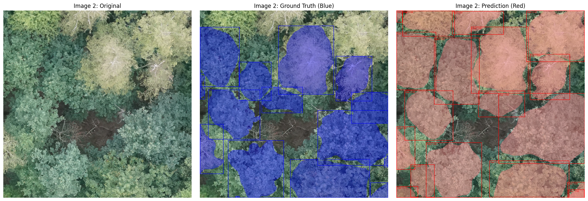
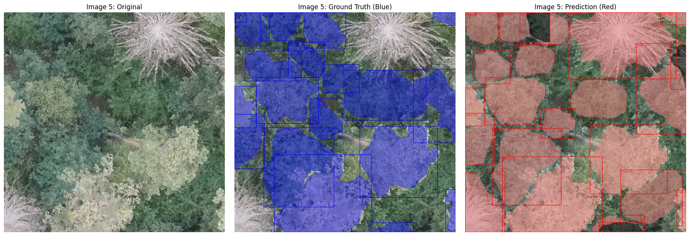
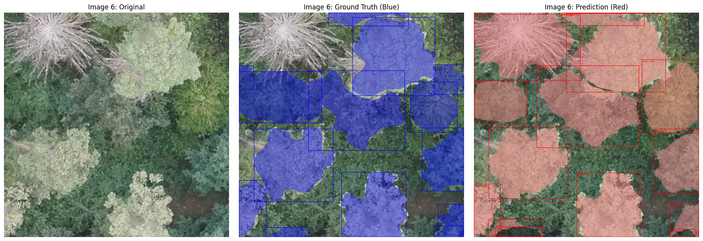

# Tree Crown Instance Segementation using a Mask R-CNN
Final assignment for the AI-class by Konstantin Müller. Tree crown instance segmenation using a Mask R-CNN and BAMforest.

## Content

- _plots:_ plots and images
- _downloadBamforest.py_: A script to download the dataset to drive
- _Instance_Tree_Segmentation.ipynb_: The main script to train and test the model. Includes several option to change data and hyperparameters. Its also possible to load an already trained model to test it or to continue a disrupted training process.
- _presentation.pdf_: A presentation giving an overview and context to the work done.
- _data&model_: contains the test_data_snippet and the model itself neccessary to run the instance_segmantation_example.py. The test data was randomly selected.

## Introduction
Tree crown segmentation is a basic step in tree-level analysis, enabling tasks such as individual species classification, crown metric extraction and tree counting.

## Training Data
The [BamForests](https://www.mdpi.com/2072-4292/16/11/1935) was used as training data. The dataset consists of 27,160 labeled trees in total at a ground sampling distance of 1.61-1.81 cm.
It covers deciduous, mixed and coniferous forests at four different sites. Three of them will be used for training, validation and testing.

## Model architecture
A [Mask R-CNN](https://arxiv.org/abs/1703.06870) was used to perform the instance segmentation. Mask R-CNN is an extension of Faster R-CNN. While Faster R-CNN is limited to object detection (bounding box), Mask R-CNN adds a branch for an object mask (instance segmentation). 

#### Backbone
[ResNet34](https://arxiv.org/pdf/1512.03385) was used as the backbone. [Pretrained weights](https://download.pytorch.org/models/resnet34-b627a593.pth) were downloaded using Pytorch.
ResNet uses skip connections to overcome the "vanishing gradient". 
A Feature Pyramide Network (FPN) to create a multiscale feature map. This is usefull to detect objects (in this case trees) of all sizes.

## Methodology
#### Data

Both of the *Tretzendorf* and the *Stadtwald* sites were used to train the model. *Test-Set-2* was used as test data and consist of images taken in the same areas as *Tretzendorf* and *Stadtwald*.
All images were used in the original 1024x1024 format.

#### Learning Rate (LR)
A learning rate scheduler was used, which halves the LR if the validation loss did not decrease in three consecutive epochs. The inital LR was 0.0003.

#### Further Hyperparameters

A batch size of 4 was used, but gradient accumulation lead to an effective batch size of 16.
A weight decay of 0.001 was used.

#### Augmentation
These Augmentations where implemented randomly:

- vertical reflection with `torch.flip` (50% chance)
- vertical reflection with `torch.flip` (50% chance)
- rotation by 90°, 180° or 270° (25% chance each)
- changes in contrast (45% chance)
- Gaussian blur with a kernel-size of 3 (35%)
- Random Resize with bilinear interpolation (35%)

#### Optimizer
[AdamW](https://arxiv.org/abs/1711.05101) optimizer was used.

## Results

#### Accuracy metrics 
For each segmented tree, the Intersection over Union (IoU) was calculated. As in [similar papers](https://doi.org/10.1002/rse2.332), each tree with an IoU < 0.5 was regarded as a true positive. 
Based on this definition, regular metrics as overall accuracy, recall, precision and f1-score were calculated:

Accuracy: 0.525 
F1 Score: 0.688
Precision: 0.637
Recall: 0.749

The models classification errors are mostly false positives.
These metrics slightly outperform the results from this [paper](https://doi.org/10.1002/rse2.332).

#### Examples

Most problems seem to occur when the model recognizes old/dead trees as vital trees or in general just labels more trees.

## Sources
