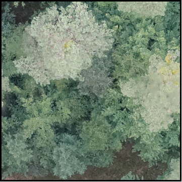
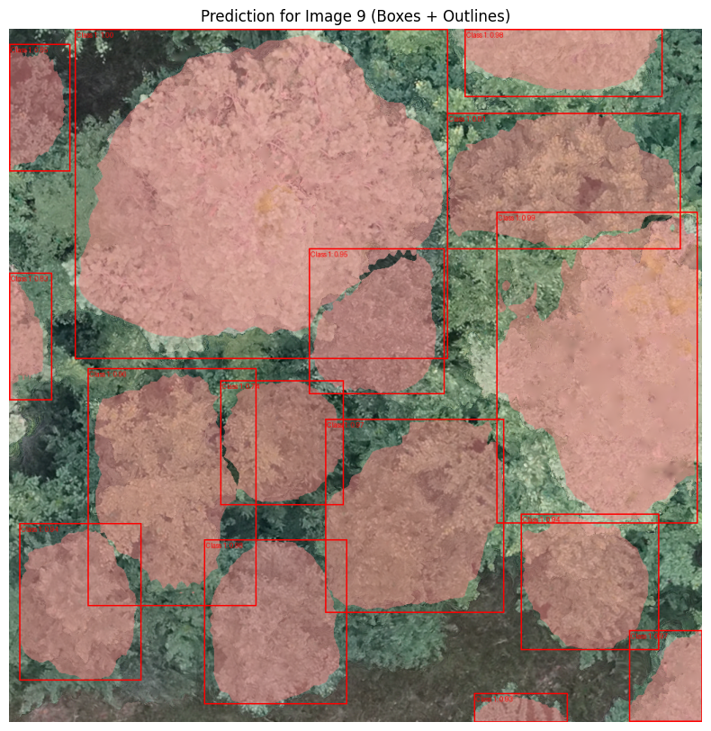

# Tree Crown Instance Segementation using a Mask R-CNN
Final assignemt for the AI-class by Konstantin Müller. Tree crown segmenation using a Mask R-CNN and BAMforest.

## Introduction
Tree crown segmentation is a basic step in tree-level analysis, enabling tasks such as individual species classification, crown metric extraction and tree counting.

  
  ➡️
  

00"/> ➡️ 

## Training Data
The [BamForests](https://www.mdpi.com/2072-4292/16/11/1935) was used as training data. The dataset consists of 27,160 labeled trees in total at a ground sampling distance of 1.61-1.81 cm.
It covers deciduous, mixed and coniferous forests at four different sites. Three of them will be used for training, validation and testing.

## Model architecture
A [Mask R-CNN](https://arxiv.org/abs/1703.06870) was used to perform the instance segmentation. Mask R-CNN is an extension of Faster R-CNN. While Faster R-CNN is limited to object detection (bounding box), Mask R-CNN adds a branch for an object mask (instance segmentation). 

#### Backbone
[ResNet34](https://arxiv.org/pdf/1512.03385) was used as the backbone. [Pretrained weights](https://download.pytorch.org/models/resnet34-b627a593.pth) were downloaded using Pytorch.
ResNet uses skip connections to overcome the "vanishing gradient". 
A Feature Pyramide Network (FPN) to create a multiscale feature map. This is usefull to detect objects (in this case trees) of all sizes.

## Methodology
#### Data

Both of the *Tretzendorf* and the *Stadtwald* sites were used to train the model. *Test-Set-2* was used as test data and consist of images taken in the same areas as *Tretzendorf* and *Stadtwald*.
All images were used in the original 1024x1024 format.

#### Learning Rate (LR)
A learning rate scheduler was used, which halves the LR if the validation loss did not decrease in two consecutive epochs. The inital LR was 0.0001.

#### General Hyperparameters

A batch size of 4 and a weight decay of 0.01 was used.

#### Augmentation
Because of the already large dataset, only a simple reflection augmentation was used (horizonatlly and vertically) using `torch.flip`.
#### Optimizer
[AdamW](https://arxiv.org/abs/1711.05101) optimizer was used.

## Results

#### Accuracy metrics 
For each segmented tree, the Intersection over Union (IoU) was calculated. As in [similar papers](https://doi.org/10.3390/rs12081288), each tree with an IoU < 0.5 was regarded as a true positive. 
Based on this definition, regular metrics as overall accuracy, recall, precision and f1-score were calculated.

#### Examples

## Sources
