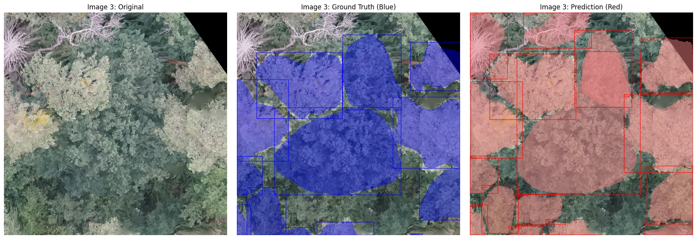
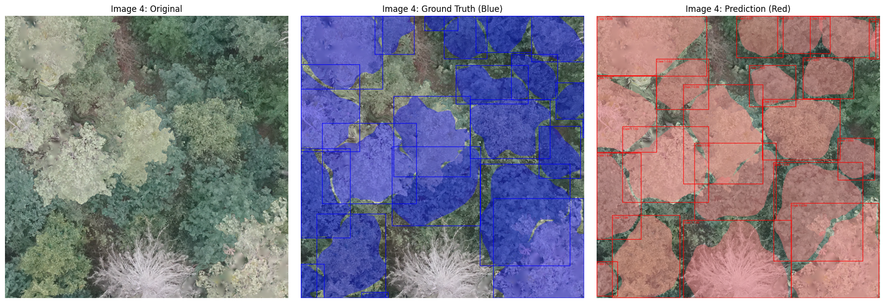

# Tree Crown Instance Segmentation using a Mask R-CNN
Final assignment for the AI-class by Konstantin Müller. Tree crown instance segmenation using a Mask R-CNN and BAMforest.

## Content

- _plots:_ plots and images
  
- _downloadBamforest.py_: A script to download the dataset to drive (runs on colab)
  
- _TrainTest_CNN.ipynb_: The main script to train and test the model. Includes several option to change data and hyperparameters. Its also possible to load an already trained model to test it or to continue a disrupted training process. (runs on colab)
  
- _presentation.pdf_: A presentation giving an overview and context to the work done.
  
- _mini_test.zip_: Contains the test_data_snippet necessary to run the instance_segmentation
    
- _useCNN.py_: A small working example of an segmentation by the trained model. Runs on the mini_test_set.zip-data. (runs locally)

- _Release_: The actual model weights, called by useCNN.py.

## Introduction
Tree crown segmentation is a basic step in tree-level analysis, enabling tasks such as individual species classification, crown metric extraction and tree counting.

## Training Data
The [BamForests](https://www.mdpi.com/2072-4292/16/11/1935) [1] was used as training data. The dataset consist of 27,160 labeled trees in total at a ground sampling distance of 1.61-1.81 cm.
It covers deciduous, mixed and coniferous forests at four different sites. Three of them will be used for training, validation and testing.

## Model architecture
A [Mask R-CNN](https://arxiv.org/abs/1703.06870) [2] was used to perform the instance segmentation. Mask R-CNN is an extension of Faster R-CNN. While Faster R-CNN is limited to object detection (bounding box), Mask R-CNN adds a branch for an object mask (instance segmentation). 
 

The architecture is often used to perform instance segmentation on tree crowns [3,4,5].

#### Backbone
[ResNet34](https://arxiv.org/pdf/1512.03385) [6] was used as the backbone. [Pretrained weights](https://download.pytorch.org/models/resnet34-b627a593.pth) were downloaded using Pytorch.
ResNet uses skip connections to overcome the "vanishing gradient". 
A Feature Pyramid Network (FPN) [7] to create a multiscale feature map. This is useful to detect objects (in this case trees) of all sizes.

## Methodology
#### Data

Both of the *Tretzendorf* and the *Stadtwald* sites were used to train the model. *Test-Set-2* was used as test data and consist of images taken in the same areas as *Tretzendorf* and *Stadtwald*.
All images were used in the original 1024x1024 format.

#### Learning Rate (LR)
A learning rate scheduler was used, which halves the LR if the validation loss did not decrease in three consecutive epochs. The initial LR was 0.0003.

#### Further Hyperparameters

A batch size of 4 was used, but gradient accumulation led to an effective batch size of 16.
A weight decay of 0.001 was used.

#### Augmentation

These Augmentations were implemented randomly:

- vertical reflection with `torch.flip` (50% chance)
- horizontal reflection with `torch.flip` (50% chance)
- rotation by 90°, 180° or 270° (25% chance each)
- changes in contrast (45% chance)
- Gaussian blur with a kernel-size of 3 (35%)
- Random Resize with bilinear interpolation (35%)

These augmentations were used because they are regularly used in tree crown segmentations [8].

#### Optimizer
[AdamW](https://arxiv.org/abs/1711.05101) [9] optimizer was used.

## Results

#### Accuracy metrics 
For each segmented tree, the Intersection over Union (IoU) was calculated. As in [similar papers](https://doi.org/10.1002/rse2.332), each tree with an IoU < 0.5 was regarded as a true positive. 
Based on this definition, regular metrics as overall accuracy, recall, precision and f1-score were calculated:

Accuracy: 0.525 
F1 Score: 0.688
Precision: 0.637
Recall: 0.749

The models classification errors are mostly false positives.
These metrics slightly outperform the results from this [paper](https://doi.org/10.1002/rse2.332) which also uses Mask R-CNN in a tropical forest to segment tree crowns.

#### Examples

Most problems seem to occur when the model labels dead trees.

## Sources

1. Troles J, Schmid U, Fan W, Tian J (2024)
BAMFORESTS: Bamberg Benchmark Forest Dataset of Individual Tree Crowns in Very-High-Resolution UAV Images. Remote Sensing, 16(11):1935.

2. He K, Gkioxari G, Dollár P, Girshick R (2017)
Mask R-CNN. arXiv:1703.06870.

3. Hao Z, Lin L, Post CJ, Mikhailova EA, Li M, Chen Y, et al. (2021)
Automated tree-crown and height detection in a young forest plantation using mask region-based convolutional neural network (Mask R-CNN). ISPRS Journal of Photogrammetry and Remote Sensing, 178:112–123.

4. Ball JGC, Hickman SHM, Jackson TD, Koay XJ, Hirst J, Jay W, et al. (2023)
Accurate delineation of individual tree crowns in tropical forests from aerial RGB imagery using Mask R-CNN. Remote Sensing in Ecology and Conservation, 9(5):641–655.

5. Braga JRG, Peripato V, Dalagnol R, Ferreira MP, Tarabalka Y, Aragão LEOC, et al. (2020)
Tree Crown Delineation Algorithm Based on a Convolutional Neural Network. Remote Sensing, 12(8):1288.

6. He K, Zhang X, Ren S, Sun J (2016)
Deep Residual Learning for Image Recognition. CVPR, 770–778.

7. Lin TY, Dollár P, Girshick R, He K, Hariharan B, Belongie S (2017)
Feature Pyramid Networks for Object Detection. CVPR, 2117–2125.

8. Zhao H, Morgenroth J, Pearse G, Schindler J (2023)
A Systematic Review of Individual Tree Crown Detection and Delineation with Convolutional Neural Networks (CNN). Current Forestry Reports, 9:149–170.

9. Loshchilov I, Hutter F (2019)
Decoupled Weight Decay Regularization. ICLR.
