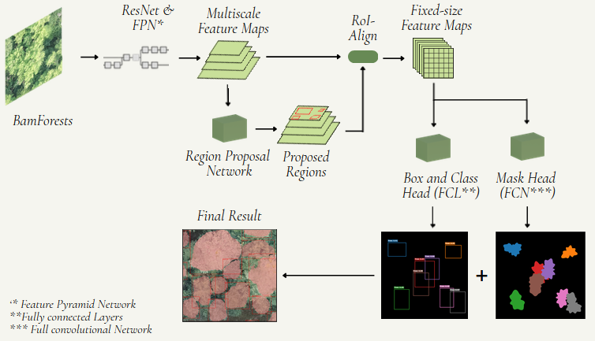

# Tree Crown Instance Segementation using a Mask R-CNN
Final assignemt for the AI-class by Konstantin Müller. Tree crown segmenation using a Mask R-CNN and BAMforest.
## Introduction
Tree crown segmentation is a basic step in tree-level analysis, enabling tasks such as individual species classification, crown metric extraction and tree counting.
## Training Data
The [BamForests](https://www.mdpi.com/2072-4292/16/11/1935) was used as training data. The dataset consists of 27,160 labeled trees in total at a ground sampling distance of 1.61-1.81 cm.
It covers deciduous, mixed and coniferous forests at four different sites. Three of them will be used for training, validation and testing.
## Model architecture
A [Mask R-CNN](https://arxiv.org/abs/1703.06870) was used to perform the instance segmentation. Mask R-CNN is an extension of Faster R-CNN. While Faster R-CNN is limited to object detection (bounding box), Mask R-CNN adds a branch for an object mask (instance segmentation). The AdamW-optimizer was used.

#### Backbone
[ResNet34](https://arxiv.org/pdf/1512.03385) was used as the backbone. [Pretrained weights](https://download.pytorch.org/models/resnet34-b627a593.pth) were downloaded using Pytorch.
ResNet uses skip connections to overcome the "vanishing gradient". 
A Feature Pyramide Network (FPN) to create a multiscale feature map. This is usefull to detect objects (in this case trees) of all sizes.

## Augmentation
Because of the already large dataset, only a simple reflection augmentation was used (horizonatlly and vertically) using `torch.flip`.
